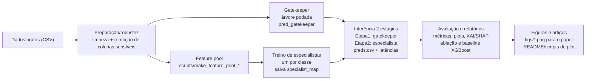

## Visão geral do fluxo 2D-AEF (CIC/UNSW)

Notas:
- Pipeline reprodutível via scripts CLI (prep, train, eval, plot, XAI).
- Resultados em `outputs/` e `figs/`; mapas/modelos em `artifacts/`.
- Baselines (ex.: XGBoost global) servem de comparação com o 2D-AEF.
